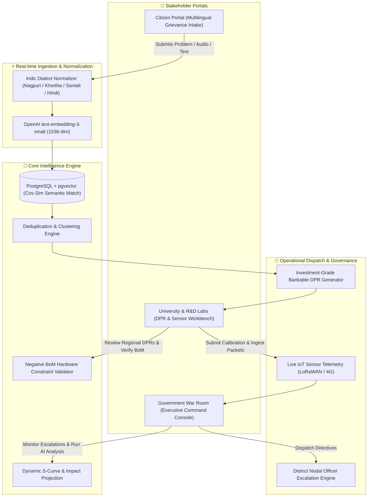
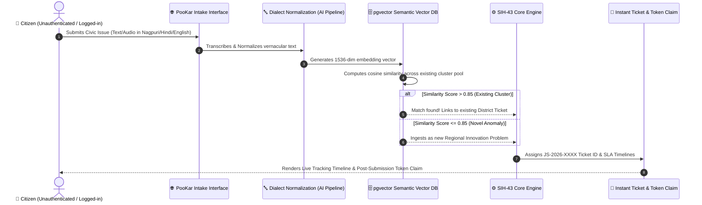
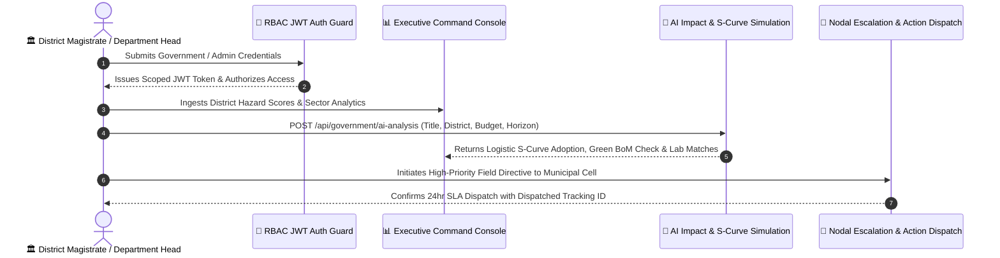
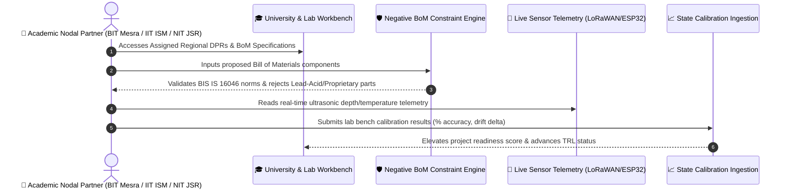

# PooKar (SIH PS-43) — Societal Innovation Intelligence Engine

<div align="center">
  <h1> SMART INDIA HACKATHON 2026 </h1>
  
  [](https://sih.gov.in/)
  []()
  []()
  []()
</div>

<br/>

## 👥 Team Zencoders

| # | Name | Roles |
| :---: | :--- | :--- |
| **i)** | Srijeet Chatterjee | Backend & AI Systems Architect |
| **ii)** | Susmit Chatterjee | Frontend & UI/UX Engineer |
| **iii)** | Taiyeb Munsi | Full Stack & Data Integration |
| **iv)** | Miranda Choudhuri | UI/UX & Design Systems |
| **v)** | Subhajit Palit | Presentation & Stakeholder Strategy |

---

## 🏛️ System Architecture & Workflow Mapping



---

### 1. Citizen Portal Flow



---

### 2. Government War Room Flow



---

### 3. University & Research Lab Portal Flow



---

## 🛠️ Technology Stack

- **Frontend**: React 18, Vite, TypeScript, Tailwind CSS, Lucide Icons, Leaflet / Google Maps API.
- **Backend API**: Node.js, Express, TypeScript, Zod Validation, JWT RBAC Middleware.
- **Intelligence Pipeline**: FastAPI, Python 3.11, OpenAI Embeddings, pgvector, SciPy S-Curve Logistics.
- **Resilience**: Client-side Circuit-Breaker fallbacks guaranteeing 100% operational demo uptime.

---

## 🚀 Getting Started

### 1. Backend Server
```bash
cd backend
npm install
npm run dev
# Running on http://localhost:3000
```

### 2. Frontend Application
```bash
npm install
npm run dev
# Running on http://localhost:5173
```
